# XMC&trade; MCU: Flash protection

This example demonstrates how flash protection can be configured in the XMC™ 4000 series of devices.

**Note:** This code example involves programming the user configuration blocks (UCB), which can only be programmed only a limited number of times. See the [Design and implementation](#design-and-implementation) section before proceeding with this code example.

## Requirements

- [ModusToolbox&trade; software](https://www.infineon.com/modustoolbox) v3.0
- [SEGGER J-Link software](https://www.segger.com/downloads/jlink/#J-LinkSoftwareAndDocumentationPack)
- Programming language: C
- Associated parts: [XMC&trade; 4000 series MCU](https://www.infineon.com/cms/en/product/microcontroller/32-bit-industrial-microcontroller-based-on-arm-cortex-m/32-bit-xmc4000-industrial-microcontroller-arm-cortex-m4/) parts

## Supported toolchains (make variable 'TOOLCHAIN')

- GNU Arm® embedded compiler v10.3.1 (`GCC_ARM`) - Default value of `TOOLCHAIN`
- Arm&reg; compiler v6.16 (`ARM`)
- IAR C/C++ compiler v9.30.1 (`IAR`)

## Supported kits (make variable 'TARGET')

- [XMC4200 Platform2Go kit](https://www.infineon.com/cms/en/product/evaluation-boards/kit_xmc_plt2go_xmc4200/) (`TARGET_KIT_XMC_PLT2GO_XMC4200`)
- [XMC4300 relax EtherCAT kit](https://www.infineon.com/cms/en/product/evaluation-boards/kit_xmc43_relax_ecat_v1/) (`TARGET_KIT_XMC43_RELAX_ECAT_V1`)
- [XMC4400 Platform2Go kit](https://www.infineon.com/cms/en/product/evaluation-boards/kit_xmc_plt2go_xmc4400/) (`TARGET_KIT_XMC_PLT2GO_XMC4400`)
- [XMC4500 relax kit](https://www.infineon.com/cms/en/product/evaluation-boards/kit_xmc45_relax_v1/) (`TARGET_KIT_XMC45_RELAX_V1`)
- [XMC4700 relax kit](https://www.infineon.com/cms/en/product/evaluation-boards/kit_xmc47_relax_v1/) (`KIT_XMC47_RELAX_V1`) - Default value of `TARGET`
- [XMC4800 relax EtherCAT kit](https://www.infineon.com/cms/en/product/evaluation-boards/kit_xmc48_relax_ecat_v1/) (`TARGET_KIT_XMC48_RELAX_ECAT_V1`)


## Hardware setup

This example uses the board's default configuration. See the kit user guide to ensure that the board is configured correctly.

## Software setup

Install a terminal emulator if you don't have one. Instructions in this document use [Tera Term](https://ttssh2.osdn.jp/index.html.en).

## Using the code example

Create the project and open it using one of the following:

<details open><summary><b>In Eclipse IDE for ModusToolbox&trade; software</b></summary>

1. Click the **New Application** link in the **Quick Panel** (or, use **File** > **New** > **ModusToolbox Application**). This launches the [Project Creator](https://www.infineon.com/ModusToolboxProjectCreator) tool.

2. Pick a kit supported by the code example from the list shown in the **Project Creator - Choose Board Support Package (BSP)** dialog.

   When you select a supported kit, the example is reconfigured automatically to work with the kit. To work with a different supported kit later, use the [Library Manager](https://www.infineon.com/ModusToolboxLibraryManager) to choose the BSP for the supported kit. You can use the Library Manager to select or update the BSP and firmware libraries used in this application. To access the Library Manager, click the link from the **Quick Panel**.

   You can also just start the application creation process again and select a different kit.

   If you want to use the application for a kit not listed here, you may need to update the source files. If the kit does not have the required resources, the application may not work.

3. In the **Project Creator - Select Application** dialog, choose the example by enabling the checkbox.

4. (Optional) Change the suggested **New Application Name**.

5. The **Application(s) Root Path** defaults to the Eclipse workspace which is usually the desired location for the application. If you want to store the application in a different location, you can change the *Application(s) Root Path* value. Applications that share libraries should be in the same root path.

6. Click **Create** to complete the application creation process.

For more details, see the [Eclipse IDE for ModusToolbox&trade; software user guide](https://www.infineon.com/MTBEclipseIDEUserGuide) (locally available at *{ModusToolbox&trade; software install directory}/ide_{version}/docs/mtb_ide_user_guide.pdf*).

</details>

<details open><summary><b>In command-line interface (CLI)</b></summary>

ModusToolbox&trade; software provides the Project Creator as both a GUI tool and the command line tool, "project-creator-cli". The CLI tool can be used to create applications from a CLI terminal or from within batch files or shell scripts. This tool is available in the *{ModusToolbox&trade; software install directory}/tools_{version}/project-creator/* directory.

Use a CLI terminal to invoke the "project-creator-cli" tool. On Windows, use the command line "modus-shell" program provided in the ModusToolbox&trade; software installation instead of a standard Windows command-line application. This shell provides access to all ModusToolbox&trade; software tools. You can access it by typing `modus-shell` in the search box in the Windows menu. In Linux and macOS, you can use any terminal application.

This tool has the following arguments:

Argument | Description | Required/optional
---------|-------------|-----------
`--board-id` | Defined in the `<id>` field of the [BSP](https://github.com/Infineon?q=bsp-manifest&type=&language=&sort=) manifest | Required
`--app-id`   | Defined in the `<id>` field of the [CE](https://github.com/Infineon?q=ce-manifest&type=&language=&sort=) manifest | Required
`--target-dir`| Specify the directory in which the application is to be created if you prefer not to use the default current working directory | Optional
`--user-app-name`| Specify the name of the application if you prefer to have a name other than the example's default name | Optional

<br>

The following example will clone the [Flash protection](https://github.com/Infineon/mtb-example-xmc-flash-protection) application with the desired name "MyFlashProtection" configured for the *KIT_XMC47_RELAX_V1* BSP into the specified working directory, *C:/mtb_projects*:

   ```
   project-creator-cli --board-id KIT_XMC47_RELAX_V1 --app-id mtb-example-xmc-flash-protection --user-app-name MyFlashProtection --target-dir "C:/mtb_projects"
   ```

**Note:** The project-creator-cli tool uses the `git clone` and `make getlibs` commands to fetch the repository and import the required libraries. For details, see the "Project creator tools" section of the [ModusToolbox&trade; software user guide](https://www.infineon.com/ModusToolboxUserGuide) (locally available at *{ModusToolbox&trade; software install directory}/docs_{version}/mtb_user_guide.pdf*).

</details>

<details open><summary><b>In third-party IDEs</b></summary>

**Note:** Only VS Code is supported.

1. Follow the instructions from the **In command-line interface (CLI)** section to create the application, and import the libraries using the `make getlibs` command.

2. Export the application to a supported IDE using the `make <ide>` command.

   For a list of supported IDEs and more details, see the "Exporting to IDEs" section of the [ModusToolbox&trade; software user guide](https://www.infineon.com/ModusToolboxUserGuide) (locally available at *{ModusToolbox&trade; software install directory}/docs_{version}/mtb_user_guide.pdf*).

3. Follow the instructions displayed in the terminal to create or import the application as an IDE project.

</details>

## Operation

1. Connect the board to your PC using a micro-USB cable through the debug USB connector.

   **Note:** XMC4500 relax kit does not enumerate as a virtual COM port. You need to make the connections externally using a USB to Serial converter with the following connections:

   Pin function  | Input/output | XMC&trade; MCU pin |
   ------- | --------- | -----------------
   Transmit pin for UART communication (PC_RX) | Output | P1.5 (U0C0.DOUT0)
   Receive pin for UART communication (PC_TX) | Input |  P1.4 (U0C0.DX0B)

2. Program the board using Eclipse IDE for ModusToolbox&trade; software:

      1. Select the application project in the Project Explorer.

      2. In the **Quick Panel**, scroll down, and click **\<Application Name> Program (JLink)**.
   </details>

3. After programmed, open your serial terminal software. You should see the shell application displayed as shown below.

   **Figure 1. Shell application**

   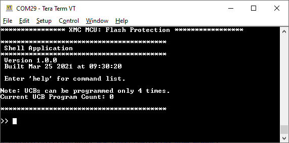

4. Do the following to install flash read protection using the shell application.

   1. Type `status` to get the status of flash protection and UCB program count.

      ```
      >> status
      ```

      **Figure 2. Protection status**

      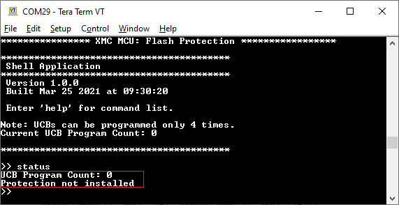

   2. Type `install <password0> <password1>` to install flash protection.

      The device will reset after this command for the changes to take effect.

      For example:

      ```
      >> install 1234 5678
      ```

      **Figure 3. Install protection**

      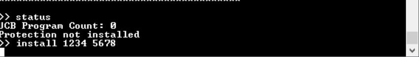

   3. Check the status to see if the flash protection is successful. The UCB program count will also be displayed.

      ```
      >> status
      ```

      **Figure 4. Protection status**

      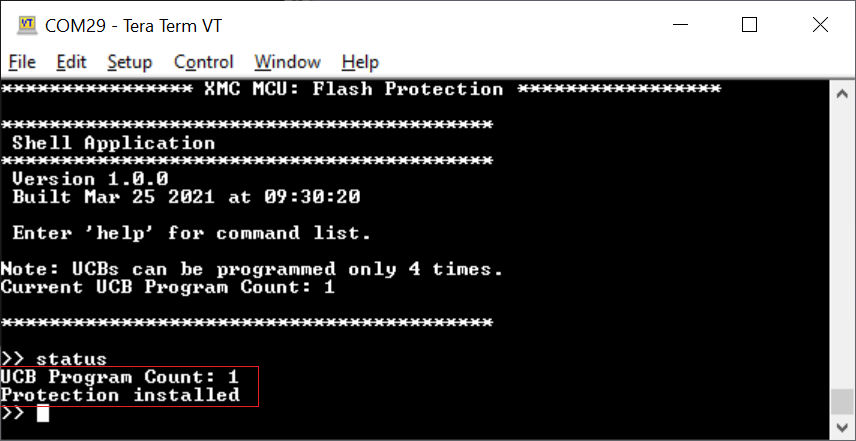

   4. Type `disable <password0> <password1>` to disable the flash protection temporarily. Use the same credentials used in Step 2.

      ```
      >> disable 1234 5678
      ```

      **Figure 5. Disable protection**

      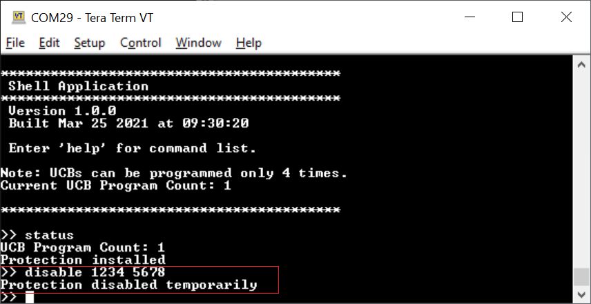

   5. Type `resume` to re-enable the flash protection installed earlier.

      ```
      >> resume
      ```

      **Figure 6. Resume protection**

      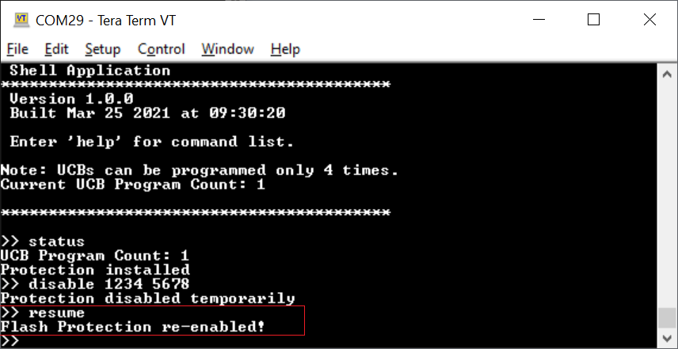

   6. Type `uninstall <password0> <password1>` to uninstall flash protection. Use the same credentials used in Step 2.

      The device will reset after this command for the changes to take effect.

      ```
      >> uninstall 1234 5678
      ```

      **Figure 7. Uninstall protection**

      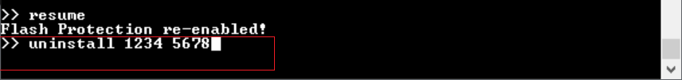

   7. Check the status to see if flash protection was uninstalled successfully.

      ```
      >> status
      ```

      **Figure 8. Protection status**

      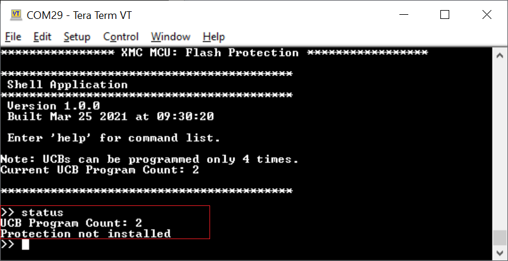

<br>


## Debugging

You can debug the example to step through the code. In the IDE, use the **\<Application Name> Debug (JLink)** configuration in the **Quick Panel**. For details, see the "Program and debug" section in the [Eclipse IDE for ModusToolbox&trade; software user guide](https://www.infineon.com/MTBEclipseIDEUserGuide).


## Design and implementation

*User configuration blocks (UCB)* are used to configure the flash read/write protection on the XMC4000 series of devices. Three UCBs can be programmed to achieve this: UCB0, UCB1, and UCB2.

In this code example, UCB0 is programmed to implement global flash read protection. The code example firmware flow is illustrated below:

**Figure 9. Firmware flow diagram**

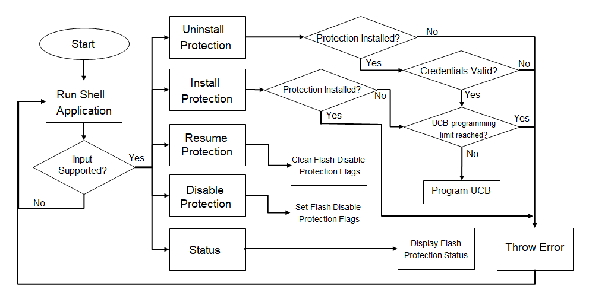

The code example uses a shell application to take input commands from the user to perform five different operations:

Command | Arguments | Description
------- | --------- | -----------------
`install` | `<pwd0> <pwd1>` |  Programs global flash read protection on the flash rows with passwords `pwd0` and `pwd1`
`uninstall` | `<pwd0> <pwd1>` | Removes flash protection with previously configured passwords
`disable` | `<pwd0> <pwd1>` | Disables flash protection temporarily with previously configured passwords
`resume` | None | Re-enables previously configured flash protection
`status` | None | Displays the flash protection status

<br>

**Note:** The protection installation is modified by erasing and programming the UCBs with dedicated command sequences as described in the firmware flow diagram. **The erase and re-program of the UCBs can be performed up to four times. Exceeding this limit may make the device unusable.**


## Resources and settings

The code example uses a custom *design.modus* file because it uses the *universal serial interface channel (USIC)* block to implement the shell application. The following settings were modified in the default *design.modus* file.

**Figure 10. USIC (UART) settings**


**Figure 11. UART Rx pin settings**

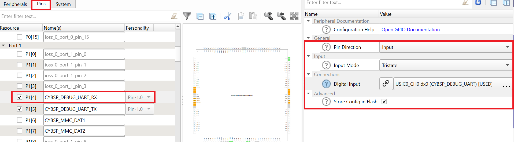


**Figure 12. UART Tx pin settings**

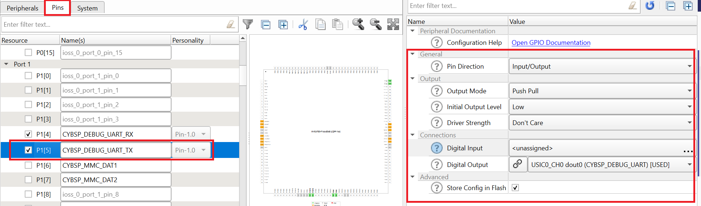

## Debugging
You can debug the example to step through the code. In the IDE, use the **\<Application Name> Debug (JLink)** configuration in the **Quick Panel**. For more details, see the "Program and debug" section in the [Eclipse IDE for ModusToolbox&trade; software user guide](https://www.infineon.com/MTBEclipseIDEUserGuide).


## Related resources
Resources | Links
----------|--------
Kit guides  | [XMC4700 relax kit V1](https://www.infineon.com/dgdl/Infineon-Board_User_Manual_XMC4700_XMC4800_Relax_Kit_Series-UM-v01_02-EN.pdf?fileId=5546d46250cc1fdf01513f8e052d07fc)
Code examples  | [Using ModusToolbox&trade; software](https://github.com/Infineon/Code-Examples-for-ModusToolbox-Software) on GitHub
Device documentation | [XMC4000 family datasheets](https://www.infineon.com/cms/en/product/microcontroller/32-bit-industrial-microcontroller-based-on-arm-cortex-m/32-bit-xmc4000-industrial-microcontroller-arm-cortex-m4/#document-group-myInfineon-49) <br> [XMC4000 family technical reference manuals](https://www.infineon.com/cms/en/product/microcontroller/32-bit-industrial-microcontroller-based-on-arm-cortex-m/32-bit-xmc4000-industrial-microcontroller-arm-cortex-m4/#document-group-myInfineon-44)
Development kits | [XMC&trade; MCU eval boards](https://www.infineon.com/cms/en/product/microcontroller/32-bit-industrial-microcontroller-based-on-arm-cortex-m/#boards)
Libraries on GitHub | [mtb-xmclib-cat3](https://github.com/Infineon/mtb-xmclib-cat3) – XMC&trade; MCU peripheral library (XMCLib) and docs
Tools | [Eclipse IDE for ModusToolbox&trade; software](https://www.infineon.com/modustoolbox) – ModusToolbox&trade; software is a collection of easy-to-use software and tools enabling rapid development with Infineon MCUs, covering applications from embedded sense and control to wireless and cloud-connected systems using AIROC&trade; Wi-Fi and Bluetooth® connectivity devices.

## Other resources

Infineon provides a wealth of data at www.infineon.com to help you select the right device, and quickly and effectively integrate it into your design.

For XMC&trade; MCU devices, see [32-bit XMC™ industrial microcontroller based on Arm® Cortex®-M](https://www.infineon.com/cms/en/product/microcontroller/32-bit-industrial-microcontroller-based-on-arm-cortex-m/).

## Document history

Document title: *CE232719* - *XMC&trade; MCU: Flash protection*

 Version | Description of change
 ------- | ---------------------
 1.0.0   | New code example
 1.1.0   | Added support for new kits
 2.0.0   | Updated to support ModusToolbox™ software v3.0; CE will not be backward compatible with previous versions of ModusToolbox™ software
 2.1.0   | Added support for new kits
------

All other trademarks or registered trademarks referenced herein are the property of their respective owners.

© 2022 Infineon Technologies AG

All Rights Reserved.

### Legal disclaimer

The information given in this document shall in no event be regarded as a guarantee of conditions or characteristics. With respect to any examples or hints given herein, any typical values stated herein and/or any information regarding the application of the device, Infineon Technologies hereby disclaims any and all warranties and liabilities of any kind, including without limitation, warranties of non-infringement of intellectual property rights of any third party.

### Information

For further information on technology, delivery terms and conditions and prices, please contact the nearest Infineon Technologies Office (www.infineon.com).

### Warnings

Due to technical requirements, components may contain dangerous substances. For information on the types in question, please contact the nearest Infineon Technologies Office.

Infineon Technologies components may be used in life-support devices or systems only with the express written approval of Infineon Technologies, if a failure of such components can reasonably be expected to cause the failure of that life-support device or system or to affect the safety or effectiveness of that device or system. Life support devices or systems are intended to be implanted in the human body or to support and/or maintain and sustain and/or protect human life. If they fail, it is reasonable to assume that the health of the user or other persons may be endangered.

-------------------------------------------------------------------------------
